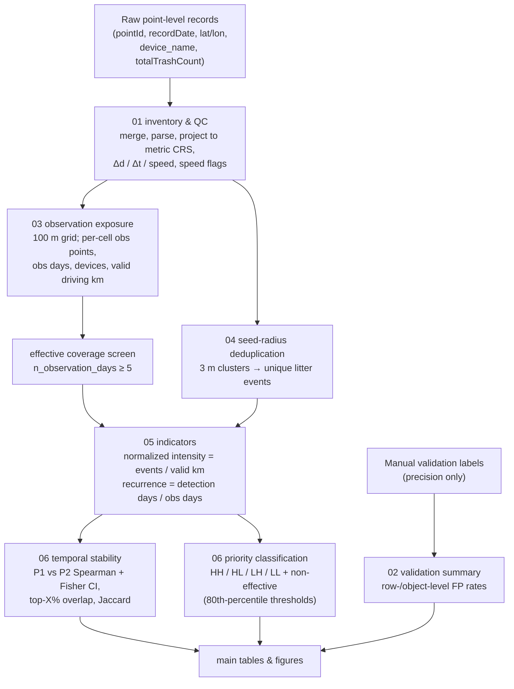

# Analytical workflow

This repository implements the **downstream, post-detection analytical pipeline**
that converts vehicle-mounted AI road-litter detections into exposure-normalized,
recurrence-aware municipal priority indicators. The upstream AI detection model is
**not** part of this repository (see `docs/privacy_and_data_access.md`).

## Stage overview

## Stage-by-stage

| # | Module | What it does |
|---|--------|--------------|
| 01 | `src/01_inventory.py` | Merge input CSV(s); parse timestamps; project WGS84 → metric CRS (EPSG:6673); per-device inter-point distance/time/speed; assign one speed flag per row (`first_row` > `dt_nonpositive` > `gps_jump` > `abnormal_high` > `ok`). No row deleted. |
| 02 | `src/02_validation.py` | Summarize a manual-validation label table into row- and object-level false-positive (precision) rates, per device and per cause. Independent of the spatial pipeline. |
| 03 | `src/03_exposure.py` | Aggregate cleaned points onto a 100 m grid per period: `n_observation_points`, `n_observation_days`, `n_devices_observed`, `valid_distance_m/km` (sum over `ok` segments). Flag effective cells (`n_observation_days ≥ 5`). |
| 04 | `src/04_deduplication.py` | 3 m **seed-radius** clustering of detection rows → unique litter events; centroid attributed to its 100 m cell. Seed-radius prevents single-link chain over-merging. |
| 05 | `src/05_indicators.py` | Join exposure + events + raw detection-days; compute `normalized_intensity_per_km` and `recurrence_ratio`; mark `effective` / `not_effective` / `div_zero`. |
| 06 | `src/06_stability_priority.py` | P1 vs P2 Spearman (with Fisher-z CIs), top-X% hotspot overlap and Jaccard, persistent/emerging/declining sets; HH/HL/LH/LL + non-effective classification at the 80th-percentile thresholds (+ sensitivity at p70/75/80/85/90). |

Orchestration: `scripts/run_pipeline.py --config <cfg>` runs 01→06 in order;
`--dry-run` validates configuration, inputs and planned outputs without
processing data. Tables and figures are regenerated by
`scripts/make_main_tables.py` and `scripts/make_main_figures.py`.
